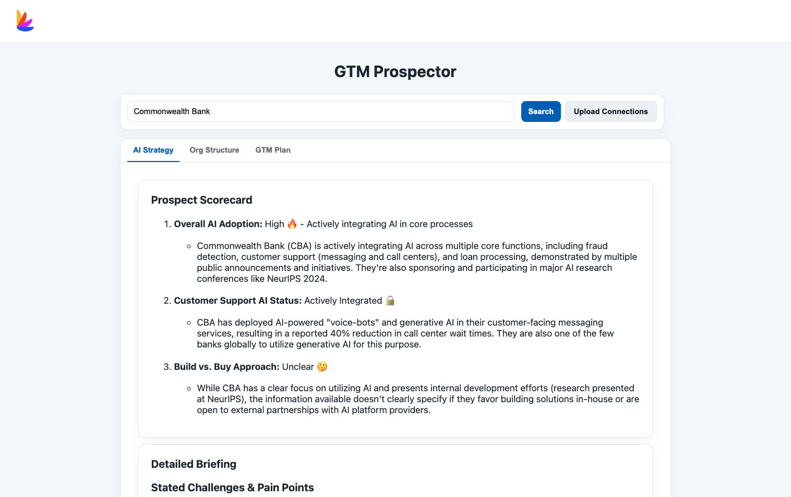

# GTM Prospector 🤖

GTM Prospector is a Flask-based web application designed to accelerate Go-To-Market (GTM) strategy creation. By inputting a company name, the tool automatically fetches recent news about the company's AI strategy, identifies key senior personnel, checks for internal connections, and uses AI to generate a detailed sales briefing and actionable outreach plan.



## ✨ Features

- **Automated Intelligence Gathering**: Scrapes the web for recent articles related to a target company's AI initiatives.
- **AI-Powered Analysis**: Uses Google's Gemini Pro to generate a concise "Prospect Scorecard" and a detailed briefing on challenges, opportunities, and key initiatives.
- **Org Chart Mapping**: Integrates with the Lusha API to find senior-level contacts at the target company.
- **Internal Connection Matching**: Upload a CSV of your LinkedIn connections to automatically flag warm leads.
- **Demo Mode**: Simply search for "Commonwealth Bank" to see a full demonstration using pre-loaded data, without consuming API credits.

## 🛠️ Setup & Installation

Follow these steps to get the application running locally.

### 1. Clone the Repository

```bash
git clone <your-repo-url>
cd gtm-prospector
```

### 2\. Create a Virtual Environment

It's recommended to use a virtual environment to manage project dependencies.

```bash
# For Mac/Linux
python3 -m venv venv
source venv/bin/activate

# For Windows
python -m venv venv
.\venv\Scripts\activate
```

### 3\. Install Dependencies

Install all the required Python packages from the `requirements.txt` file.

```bash
pip install -r requirements.txt
```

### 4\. Configure Environment Variables

The application requires API keys to function.

  - Copy the example environment file:
    ```bash
    cp .env.example .env
    ```
  - Open the new `.env` file and add your API keys from Google, Gemini, and Lusha.

### 5\. Add Static Assets

  - Place your company logo at `static/images/logo.jpg`.

### 6\. Run the Application

Start the Flask development server.

```bash
python app.py
```

The application will now be running at `http://127.0.0.1:5001`.

## 🚀 How to Use

1.  **Open the Web App**: Navigate to `http://127.0.0.1:5001` in your browser.
2.  **(Optional) Upload Connections**: Click "Upload Connections," select your name, and upload the `connections.csv` file exported from your LinkedIn account. This only needs to be done once per user.
3.  **Analyze a Company**: Enter a target company's name in the search bar and click "Search".
4.  **Review Results**: The analysis may take up to 60 seconds. Once complete, the results will be displayed in three tabs: AI Strategy, Org Structure, and GTM Plan.
